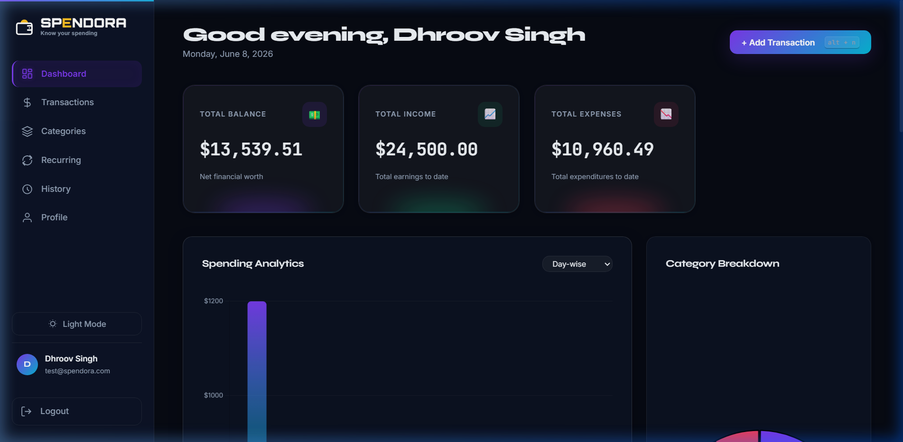
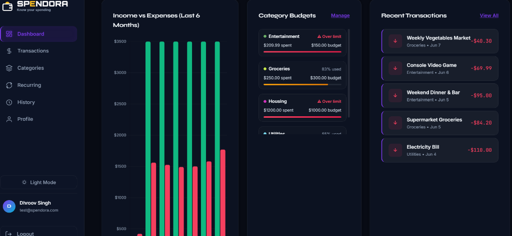
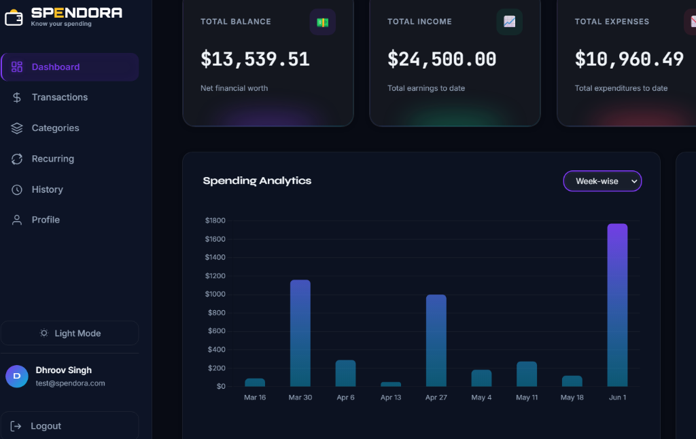
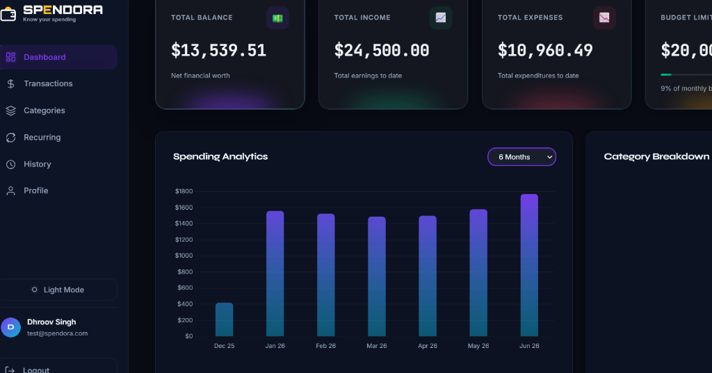
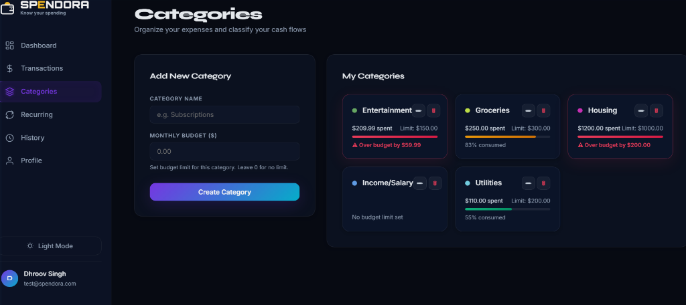
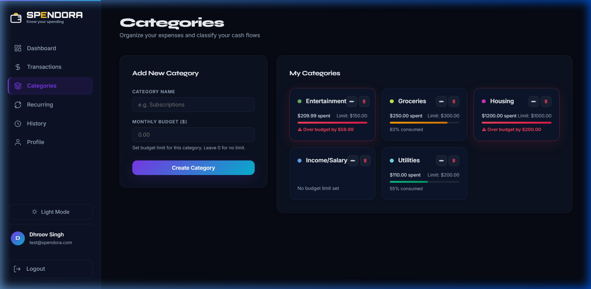
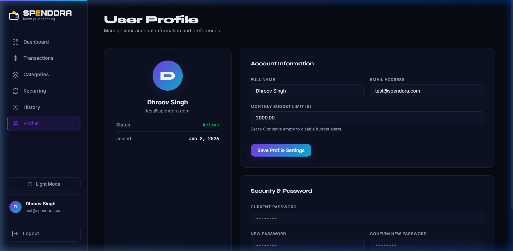

# 💵 Spendora — Premium Personal Expense Tracker

Spendora is a full-stack, glassmorphic **Personal Expense Tracker** application designed to help users manage their financial health. It allows tracking cash flows, setting category-wise budgets, scheduling recurring bills or income, and inspecting multi-interval spending distributions (day-wise to annual) through interactive data visualizations.

Built with a dark-first design, fluid CSS micro-animations, a Node.js/Express backend, and a portable, zero-configuration local PostgreSQL database downloader.

---

## 📸 Application Previews

### 1. Interactive Bento Grid Dashboard
Sleek dashboard displaying overall balance summary, recent cash flows, and category budget statuses..


### 2. Overspending Glow Warnings & Progress Bars
Exceeded budgets pulse dynamically in red with glowing shadows (`.overspent-pulse`) to alert users immediately.


### 3. Interactive Multi-Interval Spending Analytics
Analyze historical expenses dynamically. Switch between day-wise, week-wise, month-wise, 6-months, and annual intervals instantly.



### 4. Category Budget Management
Create custom categories, set spending limits, and verify consumption rates with color-coded warning cards.



### 5. Profile Settings & Theme Synchronization
Adjust budget limits and switch between dark and light themes, synchronized with your user profile in the database.


---

## 🚀 Key Features

*   **🔒 Secure JWT Authentication**: User sign-up, password hashing (with `bcryptjs`), and stateless session management.
*   **📈 Spending Analytics Bar Chart**: Toggle spending trends on the dashboard using a select menu supporting **Day-wise** (current month), **Week-wise** (last 12 weeks), **Month-wise** (last 12 months), **6 Months**, and **Annual** (yearly totals) intervals.
*   **🏷️ Category Budget Management**: Allow users to set budgets per category, display real-time consumption progress bars, and automatically highlight overspending categories with glowing red pulse animations.
*   **🔄 Automated Recurring Transactions**: Schedule weekly or monthly recurring income or expenses (e.g. Netflix, Rent) that automatically generate future transactions in the background when the user logs in.
*   **🕵️ Audit Logs & Timeline History**: Track modifications, additions, and deletions of transactions with a timeline view.
*   **🌓 Database-Synced Theme Toggle**: Beautiful dark-first glassmorphism layout, with a database-synced theme toggle to switch to light mode.
*   **⚡ Zero-Config Local Database**: Automatically downloads, installs, configures, and spins up a local portable PostgreSQL instance with one command.

---

## 🛠️ Technology Stack

### Frontend (Client)
*   **Core**: HTML5 & Modular Vanilla Javascript (ES6)
*   **Styling**: Vanilla CSS3 (Custom properties, CSS Variables, glassmorphic backdrops, Keyframe animations)
*   **Charts**: Chart.js (customized for premium dark-theme visuals)

### Backend (Server)
*   **Runtime**: Node.js & Express API Server
*   **Database**: PostgreSQL
*   **Password Encryption**: BcryptJS
*   **Tokens**: JSON Web Tokens (JWT) for secure authentication
*   **Logging & Middleware**: Morgan logger, CORS header controller

---

## 📂 Project Directory Structure

```text
Expense-Tracker/
├── client/                     # Frontend Client Files
│   ├── css/
│   │   └── style.css           # Vanilla CSS Styling & Pulsing Animations
│   ├── js/                     # Client-side JavaScript Controllers
│   │   ├── api.js              # Fetch requests & Authorization Headers
│   │   ├── auth.js             # Login/Registration Logic
│   │   ├── categories.js       # Category Management Logic
│   │   ├── dashboard.js        # Analytics & Budget Visuals
│   │   ├── recurring.js        # Recurring Schedule Event Handlers
│   │   ├── profile.js          # Profile & Budget Updates
│   │   └── transactions.js     # Transaction CRUD Logic
│   ├── pages/                  # HTML Views (Pages)
│   │   ├── categories.html
│   │   ├── dashboard.html
│   │   ├── history.html
│   │   ├── login.html
│   │   ├── profile.html
│   │   ├── recurring.html
│   │   ├── register.html
│   │   └── transactions.html
│   └── index.html              # Router / Entry point redirector
├── server/                     # Node.js/Express Backend Server
│   ├── config/
│   │   └── db.js               # PostgreSQL connection pool configuration
│   ├── controllers/            # Route Controllers (analytics, auth, categories, transactions, recurring)
│   ├── database/
│   │   └── schema.sql          # PostgreSQL table schemas
│   ├── middleware/
│   │   └── auth.js             # Token verification & recurring scheduler hook
│   ├── routes/                 # Express API routes
│   ├── services/
│   │   └── recurringService.js # Background recurring transaction engine
│   └── app.js                  # Express app & static folder routing
├── scripts/
│   ├── setup-db.js             # Portable PostgreSQL downloader & auto-initializer
│   └── seed-test-data.js       # Database seeding tool for rapid testing
├── .env                        # Configuration environment variables
├── .gitignore                  # Git ignore definitions
├── package.json                # Project dependencies and script tasks
└── README.md                   # Project documentation
```

---

## ⚙️ Installation & Setup

### 1. Clone the Repository
```bash
git clone https://github.com/Dhroovs/Expense-Tracker.git
cd Expense-Tracker
```

### 2. Install Project Dependencies
```bash
npm install
```

### 3. Spin up & Configure the Database
The setup script automatically downloads a portable version of PostgreSQL, initializes a database cluster on port `5433`, creates the `exp_tracker` database, and runs the SQL schema:
```bash
npm run setup-db
```

### 4. Create local Environment Config
Create a `.env` file in the root directory:
```env
PORT=3000
DB_USER=postgres
DB_HOST=127.0.0.1
DB_NAME=exp_tracker
DB_PORT=5433
JWT_SECRET=your_super_secret_jwt_key
JWT_EXPIRES_IN=7d
NODE_ENV=development
```

### 5. Seed Test Data
Run our seeding script to populate the database with a test user (`test@spendora.com` / `password123`), 1.5 years of historical transaction logs, category budgets, and active recurring transaction schedules:
```bash
node scripts/seed-test-data.js
```

### 6. Start the Server
Run the developer script to start the server:
```bash
npm run dev
```

Open your browser and navigate to:
👉 **[http://localhost:3000](http://localhost:3000)**

Log in with:
- **Email**: `test@spendora.com`
- **Password**: `password123`
